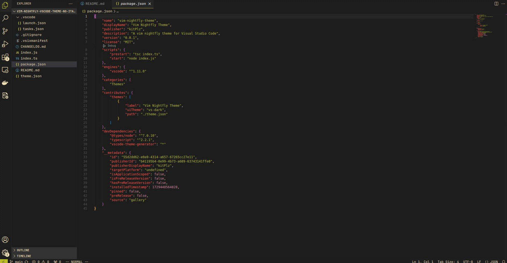

# Vim Nightfly Theme for Visual Studio (No Italic)

This repository contains a modified version of the [Vim Nightfly theme](https://marketplace.visualstudio.com/items?itemName=kitPlz.vim-nightfly-theme&ssr=false#overview) for Visual Studio Code.

All credits go to the original author. I just wanted a version of theme without the italic font style. :-)

# Screenshot

  

# License

Please check [LICENSE.md](LICENSE.md) for more information.

